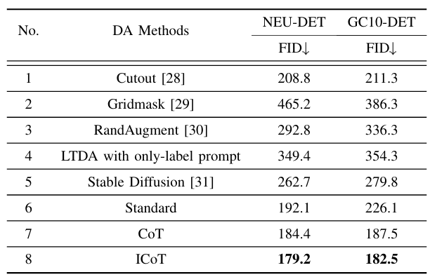
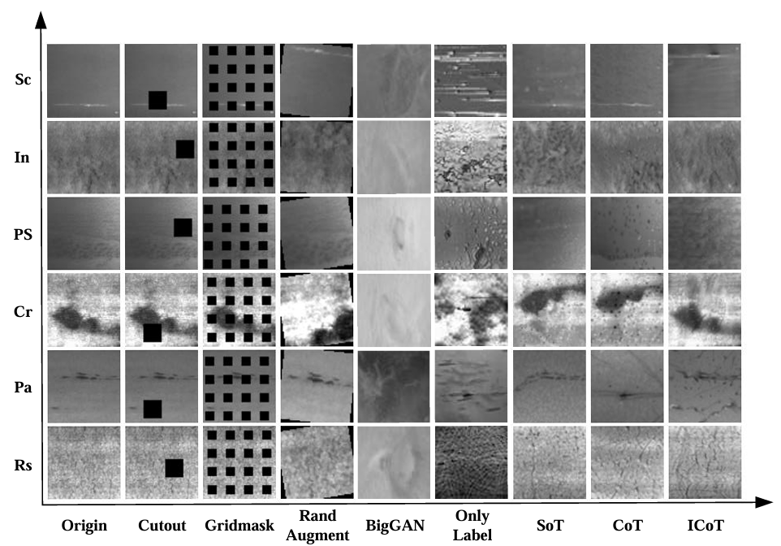
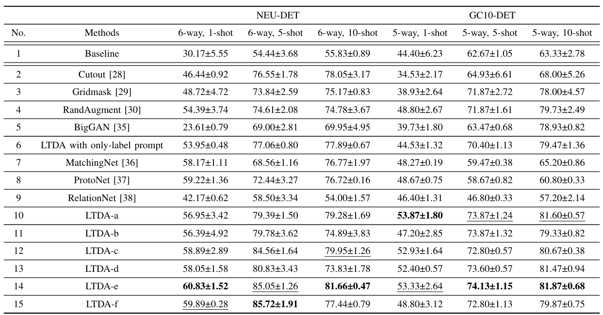
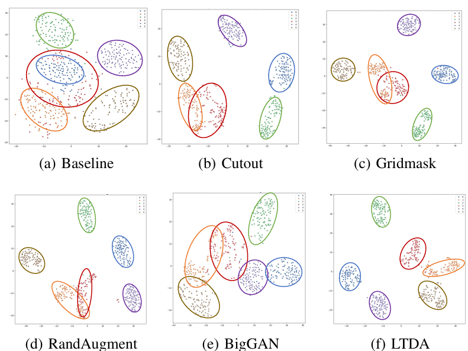
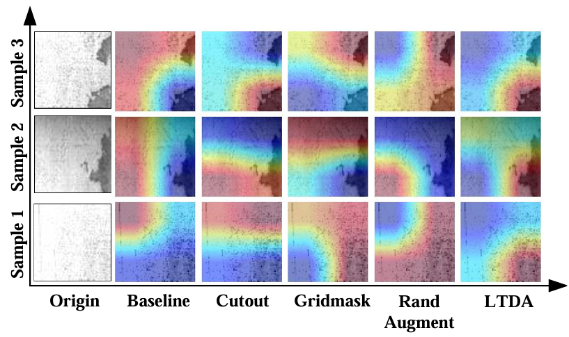

# Enhancing Few-Shot Surface Defect Recognition via Pre-Trained Large Generative Models
## Abstract
 Surface Defect Recognition (SDR) is crucial in the manufacturing industry. Recent advancements in deep learning and computer vision have significantly improved the precision
 and efficiency of SDR. However, the rarity of certain defect images and the high cost of acquiring large labeled datasets pose significant challenges for few-shot learning in accurately
 identifying and classifying surface defects. For this, this paper explores innovative contributions of Large Generative Models (LGM) to SDR by integrating Large Language Models (LLM)
 and Multimodal Generative Models (MGM). We present an LGM-based Training-Free Data Augmentation (LTDA) method to efficiently expand few-shot datasets without additional training. 
 LTDA employs a conditional generation framework that leverages text instructions provided by LLM as conditions to guide the generation process of MGM. Additionally, 
 multiple prompting templates have been designed for LLM to provide more precise instructions, thereby better guiding the conditional generation process. Finally, we employ two strategies for utilizing
 generated data to accomplish enhanced few-shot SDR by LTDA. The effectiveness of these approaches is demonstrated through two cases of defect recognition on steel surfaces, 
 where the results demonstrate that the proposed method achieves an average improvement of 29% and 13% over the baseline method.
## Method

### Flowchart for conditional generation


### Three prompt templates


### Flowchart of LTDA for few-shot SDR


## Results

### FID values of data generated by different data augmentation methods



### Synthetic images of steel suface defects in NEU-DET dataset



### ACCURACY of FEW-SHOT SDR under different methods



### Scatter plots of image features for 5-shot SDR under different data augmentation methods



### Visualization results of PS with Grad-CAM



## Code

#### data generation
```
cd DataExpansion-main/GIF_SD/CIFAR/
## put the prompt into file my_dataset_expansion.py
python my_dataset_expansion.py -a  CLIP-VIT-B32   -d NEU --checkpoint checkpoint/NEU/test  --data_dir data/5-shot-dataset --data_save_dir data/image-to-text/NEU_stable_diffusion_scale100_strength0.3_CLIP_optimization_up0.8_batch_5x  --ckpt model/stable_diffusion_v1-4.ckpt  --train-batch 1 --test-batch 1   --expanded_number_per_sample 20 --expanded_batch_size 2 --scale 100 --strength 0.3 --constraint_value 0.8 --total_split 1 --split 0
```

#### data augment
```
python cutout.py
python gridmask.py
python randaugment.py
```

#### resize the expansion dataset to 64*64
```
python data/resize-to-64.py
```

#### combine the expansion dataset and the n shot dataset
```
python data/combine.py
```

#### model training with ATD
```
python resnet50_n-shot+expansion.py
```

#### model training with APD
```
python resnet50_expansion.py
python resnet50_expansion-finetuning.py
```

#### accuracy
```
python testing.py
```

#### metric 
```
python evaluation.py
```

#### scatter
```
python scatter.py
```

#### grad_cam
```
python grad_cam
```
